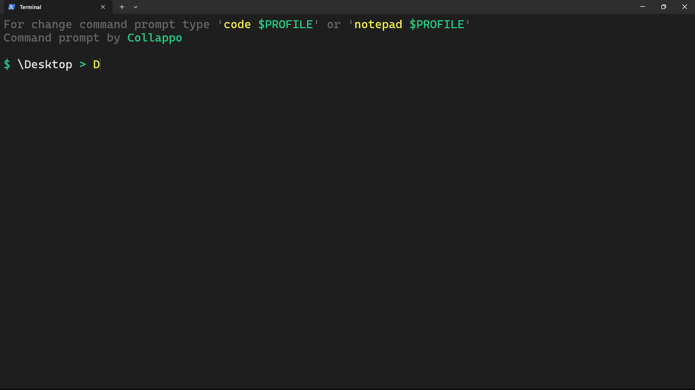

# 🖌️ Command Prompt Template 💻

Getting bored of the default PowerShell in Windows? This is for you :D


Command prompt template preview

---

## How to setup?

1) First, copy context of 
2) Edit `$PROFILE` file, type into terminal
   
    ```powershell
    notepad $PROFILE
    # or
    code $PROFILE
    ```
    *`$PROFILE` - that is a path to the file that is loaded when PowerShell starts*
    
4) Paste copied before text into `$PROFILE` file and save.

    ***Done :D***

---
